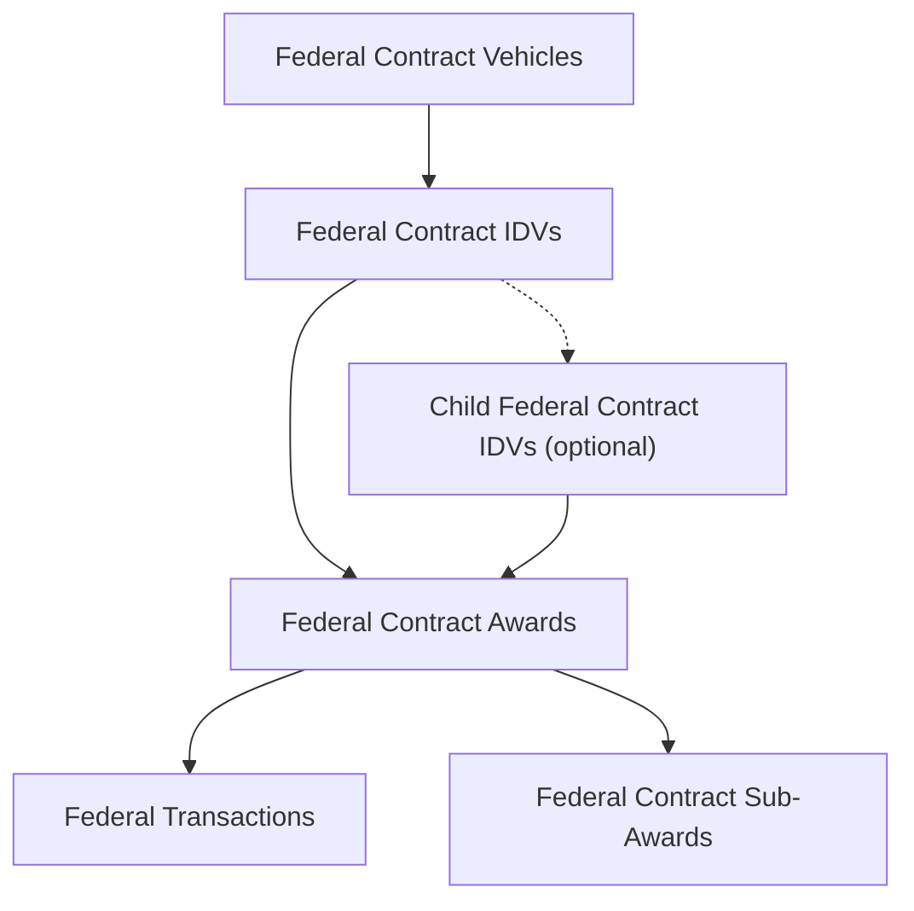

<!-- GovTribe Skills generated documentation reference. Do not edit; regenerate from the canonical public GovTribe Docs page. -->

# Federal contract data model

- Canonical GovTribe Docs page: [https://govtribe.com/docs/data-model/guides/federal-contract-data-model](https://govtribe.com/docs/data-model/guides/federal-contract-data-model)

GovTribe separates federal contracting data by where a record fits in the procurement lifecycle. Forecasts, contract opportunities, and vehicle opportunities describe planned, active, or recently noticed procurement activity. Transactions, awards, IDVs, and vehicles describe awarded activity and contract structure. DoD acquisition programs and government files add program, source-document, and pricing context around those core records.

## Hierarchy

For federal contract research, GovTribe usually connects awarded records from broad vehicle structure down to spending detail like this:

- [Federal contract vehicle](https://govtribe.com/docs/data-model/data-types/federal-contract-vehicle) records group master contract families or multiple-award programs that organize related IDVs and vehicle opportunities.
- [Federal contract IDV](https://govtribe.com/docs/data-model/data-types/federal-contract-idv) records are indefinite delivery vehicles: indefinite delivery contracts or agreements that allow agencies to place orders. In GovTribe, this includes parent instruments such as IDIQs, Federal Supply Schedule contracts, GWACs, BOAs, BPAs, requirements contracts, and definite quantity contracts. Some IDVs can also be parents of other IDVs.
- [Federal contract award](https://govtribe.com/docs/data-model/data-types/federal-contract-award) records are awarded contracts and orders, including delivery or task orders, purchase orders, definitive contracts, and BPA calls.
- [Federal transaction](https://govtribe.com/docs/data-model/data-types/federal-transaction) records show obligation, modification, and other spending activity behind federal awards or IDVs.
- [Federal contract sub-award](https://govtribe.com/docs/data-model/data-types/federal-contract-sub-award) records are reported subcontracting activity beneath prime federal contract awards.

Obligations are recorded through federal transaction activity and summarized on the award or IDV records they belong to. Awards are usually the best starting point for obligation movement. IDVs and vehicles help explain contract structure, buying lanes, holder access, and parent relationships.

Not every award has a parent IDV, not every IDV has a parent vehicle, and not every IDV has a parent or child IDV. Some records connect cleanly through source identifiers, while others are best compared through shared agency, vendor, category, date, identifier, program, or file context.

Pre-award records such as forecasts, contract opportunities, and vehicle opportunities can still connect to this awarded structure when GovTribe has enough source context.

## Pre-award types

[Federal forecast](https://govtribe.com/docs/data-model/data-types/federal-forecast), [Federal contract opportunity](https://govtribe.com/docs/data-model/data-types/federal-contract-opportunity), and [Federal contract vehicle opportunity](https://govtribe.com/docs/data-model/data-types/federal-contract-vehicle-opportunity) records describe demand before the corresponding awarded work is available in GovTribe.

Forecasts are early planning records. They can show expected requirements, timing, forecast type, agency context, NAICS or PSC signals, set-aside details, and other clues before a solicitation is available.

Contract opportunities are procurement notices from federal contracting offices. They can include pre-solicitation notices, solicitation notices, award notices, sole source notices, due dates, set-asides, files, contacts, amendments, solicitation numbers, and other procurement requirements.

Vehicle opportunities are procurement notices associated with one or more contract vehicles or vehicle subcategories. They can include posted dates, due dates, set-asides, opportunity type or status, solicitation numbers, agency context, NAICS context, source links, files, and vehicle or subcategory context.

Forecasts and contract opportunities are upstream records rather than required parent levels above awards, IDVs, or vehicles. Vehicle opportunities are pre-award records under vehicle context, so use them when demand is being competed through a specific vehicle or subcategory. In GovTribe, related tabs such as Opportunity Stack, Contract Vehicles, IDV Awards, Contract Awards, Files, and Similar Opportunities help you move from notice research into related awarded-work research when relationships are available.

## Award types

[Federal contract award](https://govtribe.com/docs/data-model/data-types/federal-contract-award) records summarize actual awarded contract work. Start with awards when you want to understand who won, how much was obligated, what contract number was used, which agency bought the work, or what performance history GovTribe has for the award.

Awards can include direct contracts such as definitive contracts and purchase orders. They can also include task-order activity such as delivery orders and BPA calls.

[Federal contract sub-award](https://govtribe.com/docs/data-model/data-types/federal-contract-sub-award) records show reported subcontracting activity beneath prime federal contract awards. They are not another parent level above awards, IDVs, or vehicles. They branch down from prime award activity.

Sub-awards can help identify subcontractors, prime-to-subcontractor relationships, teaming patterns, and agency-scoped subcontract history.

## Parent award types

[Federal contract IDV](https://govtribe.com/docs/data-model/data-types/federal-contract-idv) records are parent instruments under which agencies can issue task orders, delivery orders, BPA calls, or similar child awards. IDVs are usually tied to a vendor and can show the ordering window, parent ceiling, award type, contract type, and access to a buying instrument.

Some IDVs also sit below another IDV. In GSA MAS-style data, a [Federal contract vehicle](https://govtribe.com/docs/data-model/data-types/federal-contract-vehicle) with the contract type `Master GSA Schedule` can sit above Federal Supply Schedule IDVs, and those Federal Supply Schedule IDVs can have Blanket Purchase Agreement IDVs beneath them. In other words, a Federal Supply Schedule is an IDV-level record in GovTribe, while the Master GSA Schedule is the vehicle-level family above it.

[Federal contract vehicle](https://govtribe.com/docs/data-model/data-types/federal-contract-vehicle) records sit above some IDVs. Vehicles usually describe the broader program or family behind related parent instruments, such as a master GSA Schedule, GWAC, multi-agency IDIQ program, or BPA program. They are useful when you want to understand the broader buying lane rather than one vendor's specific parent contract.

[Federal contract vehicle subcategory](https://govtribe.com/docs/data-model/data-types/federal-contract-vehicle-subcategory) records add more detail inside a vehicle, such as pools, SINs, tracks, or other segments that shape eligibility or scope.

[DOD acquisition program](https://govtribe.com/docs/data-model/data-types/dod-acquisition-program) records provide DoD acquisition program context that GovTribe surfaces in product areas such as Major Defense Programs. They are part of federal contract research, but they are not another parent level above awards, IDVs, or vehicles. Use them as a defense-program lens for related awards, transactions, agencies, vendors, and categories.

Federal contract vehicle opportunities attach pre-award demand to this vehicle context. Use them when the question is about work currently being competed through a vehicle or subcategory. Use vehicles and IDVs when the question is about the master contract family, holder access, ordering window, or awarded task-order structure.

## Related articles

- [Contracting and funding federal agencies](https://govtribe.com/docs/data-model/guides/contracting-and-funding-federal-agencies): Choose the right federal agency field when researching procurement ownership, funding responsibility, and customer demand.
- [Federal award values and transactions](https://govtribe.com/docs/data-model/guides/federal-award-values-and-transactions): Distinguish award summaries, transaction events, obligations, potential values, and transaction value splits.
- [Vendor, awardee, recipient, and subcontractor roles](https://govtribe.com/docs/data-model/guides/vendor-awardee-recipient-and-subcontractor-roles): Interpret organization roles on prime awards, sub-awards, and vendor records.
- [Federal contract record structure](https://govtribe.com/docs/data-model/guides/federal-contract-record-structure): Choose between forecasts, opportunities, vehicles, IDVs, awards, transactions, and sub-awards.
- [Source identifiers and record matching](https://govtribe.com/docs/data-model/guides/source-identifiers-and-record-matching): Use GovTribe IDs, source identifiers, UEIs, source URLs, and originating links when comparing records.

---

For current tool schemas, parameters, response fields, or freshness-sensitive behavior, call the live `Documentation` MCP tool instead of inferring details from this bundled reference.
