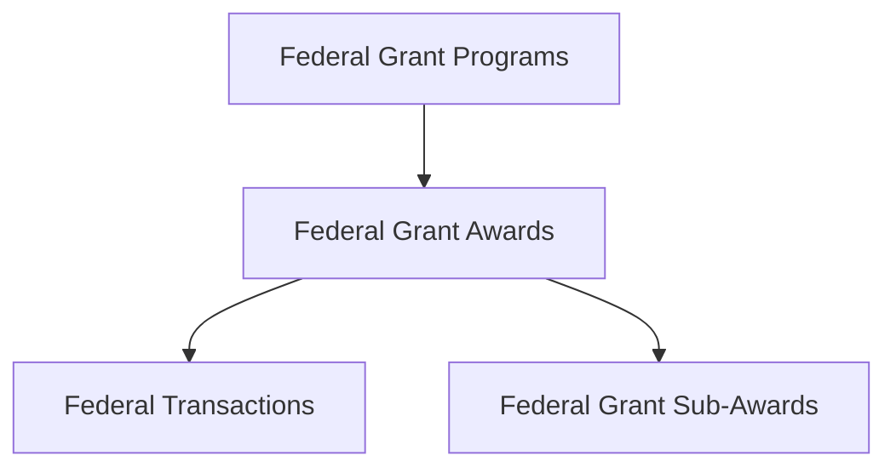

<!-- GovTribe Skills generated documentation reference. Do not edit; regenerate from the canonical public GovTribe Docs page. -->

# Federal grant data model

- Canonical GovTribe Docs page: [https://govtribe.com/docs/data-model/guides/federal-grant-data-model](https://govtribe.com/docs/data-model/guides/federal-grant-data-model)

GovTribe separates federal grant and federal financial assistance data by where a record fits in the funding lifecycle. Opportunities describe available or forecasted funding before an award. Transactions, awards, sub-awards, and programs describe awarded funding, pass-through activity, and Assistance Listing structure.

## Hierarchy

For federal grant research, GovTribe usually connects program structure down to awarded funding detail like this:

- [Federal grant program](https://govtribe.com/docs/data-model/data-types/federal-grant-program) records organize grant and assistance activity around recurring program entities, often aligned to an Assistance Listing Number (ALN, formerly CFDA Number) when source data supports it.
- [Federal grant award](https://govtribe.com/docs/data-model/data-types/federal-grant-award) records are federal financial assistance awards made to recipients, including grants and other assistance award types GovTribe groups in the grant research area.
- [Federal transaction](https://govtribe.com/docs/data-model/data-types/federal-transaction) records show award transaction activity tied to federal financial assistance awards.
- [Federal grant sub-award](https://govtribe.com/docs/data-model/data-types/federal-grant-sub-award) records are reported pass-through awards under prime federal grant awards.

Obligations are recorded through award transaction activity and summarized at the award level. Programs help explain the recurring funding lane above many awards or opportunities. Sub-awards branch down from prime awards when pass-through funding is reported.

Not every opportunity has a clean one-to-one award relationship, and not every forecasted grant opportunity becomes a posted Funding Opportunity Announcement (FOA). Some records connect through Assistance Listing numbers, program numbers, agency context, recipient context, dates, geography, files, or shared topical language.

Pre-award funding opportunities can still connect to this awarded structure when GovTribe has enough source context.

## Pre-award types

[Federal grant opportunity](https://govtribe.com/docs/data-model/data-types/federal-grant-opportunity) records describe posted and forecasted notices for grant or assistance funding before an award is made.

Grant opportunities can include Funding Opportunity Announcements (FOAs), synopses, forecast records, due dates, funding instruments, applicant types, estimated funding, points of contact, government files, agency context, and program context. They are the best starting point when you want to understand available or upcoming grant and assistance funding.

Grant opportunities are upstream notice and application records rather than required parent levels above awards or programs. In GovTribe, related tabs such as Contacts, Activity, Files, Similar Opportunities, and program-level Grant Opportunities help you move from available-funding research into related program or award research when relationships are available.

## Award types

[Federal grant award](https://govtribe.com/docs/data-model/data-types/federal-grant-award) records summarize actual federal financial assistance funding. Start with awards when you want to understand who received funding, how much was obligated, which federal agency funded the award, what assistance type was used, or which grant program the award belongs to.

Awards summarize one or more assistance transactions that share an award identifier. They are usually easier to use than transaction-level records when the question is about recipients, total dollars, program participation, or award history.

[Federal grant sub-award](https://govtribe.com/docs/data-model/data-types/federal-grant-sub-award) records show reported pass-through activity beneath prime federal grant awards. They are not another parent level above awards or programs. They branch down from prime award activity.

Sub-awards can help identify subrecipients, prime-to-subrecipient relationships, pass-through networks, and downstream recipient activity connected to a federal grant program or prime award.

## Parent award types

[Federal grant program](https://govtribe.com/docs/data-model/data-types/federal-grant-program) records organize grant and assistance activity around a recurring funding lane. A program can relate to many grant awards and opportunities over time.

Programs are useful when you start from a program number, program name, Assistance Listing Number (ALN, formerly CFDA Number), or recurring funding area rather than one notice or one award. They help connect current opportunities, historical awards, recipient patterns, and agency funding behavior.

Unlike federal contracts, federal grants do not have IDV or vehicle layers. Use programs when you need the parent funding lane above awards and opportunities.

## Related articles

- [Federal award values and transactions](https://govtribe.com/docs/data-model/guides/federal-award-values-and-transactions): Distinguish award summaries, transaction events, obligations, potential values, and transaction value splits.
- [Vendor, awardee, recipient, and subcontractor roles](https://govtribe.com/docs/data-model/guides/vendor-awardee-recipient-and-subcontractor-roles): Interpret recipient, prime grantee, sub-grantee, and vendor roles.
- [Source identifiers and record matching](https://govtribe.com/docs/data-model/guides/source-identifiers-and-record-matching): Use GovTribe IDs, source identifiers, UEIs, source URLs, and originating links when comparing records.
- [Choosing category systems](https://govtribe.com/docs/data-model/guides/choosing-category-systems): Choose between NAICS, PSC, NIGP, UNSPSC, and Assistance Listings when interpreting category fields.

---

For current tool schemas, parameters, response fields, or freshness-sensitive behavior, call the live `Documentation` MCP tool instead of inferring details from this bundled reference.
