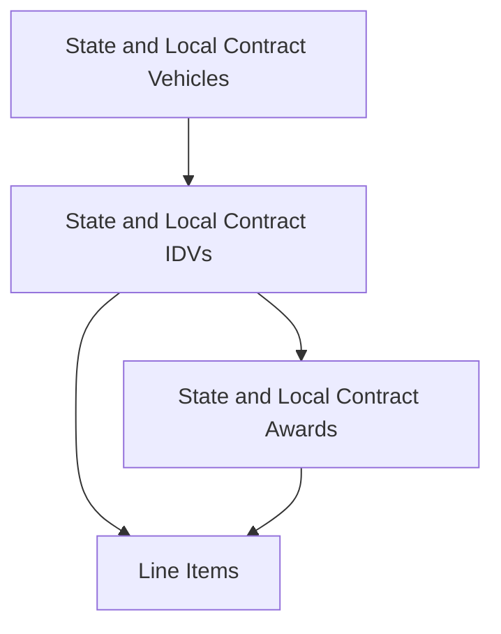

<!-- GovTribe Skills generated documentation reference. Do not edit; regenerate from the canonical public GovTribe Docs page. -->

# State and local contract data model

- Canonical GovTribe Docs page: [https://govtribe.com/docs/data-model/guides/state-and-local-contract-data-model](https://govtribe.com/docs/data-model/guides/state-and-local-contract-data-model)

State and local source data is more fragmented than federal source data. Coverage, field depth, parent-child links, values, dates, files, contacts, and category detail can vary by state, jurisdiction, source system, and record type.

## Hierarchy

For state and local contract research, GovTribe usually connects awarded records from broad contract structure down to item-level detail like this:

- [State and local contract vehicle](https://govtribe.com/docs/data-model/data-types/state-and-local-contract-vehicle) records are higher-level contract families or purchasing structures that can group related IDVs.
- [State and local contract IDV](https://govtribe.com/docs/data-model/data-types/state-and-local-contract-idv) records are parent contract structures that can connect down to child awards.
- [State and local contract award](https://govtribe.com/docs/data-model/data-types/state-and-local-contract-award) records identify awarded contracts and are usually the best starting point for historical award research.
- [Line item](https://govtribe.com/docs/data-model/data-types/line-item) records are item-level details connected to state and local awards or IDVs when source data includes them.

State and local contract data does not have a shared transaction layer like federal contract and grant data. Use awards when the question is about awarded work, historical contract activity, awardees, contract numbers, contract types, or source-provided value fields.

Not every award has a parent IDV, not every IDV has a parent vehicle, and not every opportunity later connects cleanly to an award. When a direct link is not available, compare records through state, jurisdiction, contract entity, vendor or awardee name, NIGP or UNSPSC category, dates, contract numbers, files, contacts, and similar descriptions.

Pre-award opportunities can still connect to this awarded structure when GovTribe has enough source context.

## Pre-award types

[State and local contract opportunity](https://govtribe.com/docs/data-model/data-types/state-and-local-contract-opportunity) records describe active, upcoming, or recently posted solicitations and notices from state, local, education, and related public-sector buyers.

Opportunities can include posted dates, due dates, solicitation numbers, states, jurisdictions, NIGP categories, UNSPSC categories, government files, source links, descriptions, and points of contact. They are the best starting point when you want to find current demand before awarded work appears.

Opportunities are upstream records rather than required parent levels above awards, IDVs, or vehicles. In GovTribe, related tabs such as Contacts, Activity, Files, Jurisdictions, NIGP Categories, UNSPSC Categories, and Similar Opportunities help you move from notice research into related buyer, category, file, and contact context.

## Award types

[State and local contract award](https://govtribe.com/docs/data-model/data-types/state-and-local-contract-award) records summarize actual awarded state and local contract work. Start with awards when you want to understand who won, what was awarded, when it was awarded, which state or jurisdiction was involved, or which contract number or contract type was used.

Awards can include source-provided value fields, line items, NIGP categories, UNSPSC categories, government files, contacts, state context, and sometimes a related opportunity or parent IDV. Because state and local sources are uneven, value fields should be interpreted with the source context available on the record.

State and local awards do not have a federal-style transaction history in GovTribe. When you need detail beneath an award, use the award record, attached files, source links, line items, categories, and related IDV or opportunity context.

[Line item](https://govtribe.com/docs/data-model/data-types/line-item) records provide downstream detail for state and local contracting. They can appear under awards or IDVs when the source provides item-level data.

Line items can help identify purchased goods or services, quantities, unit prices, units of measurement, NIGP categories, UNSPSC categories, or descriptive item text. They are not a transaction layer and should not be treated as obligation events.

## Parent award types

[State and local contract IDV](https://govtribe.com/docs/data-model/data-types/state-and-local-contract-idv) records are parent contract structures. Use IDVs when the question is about a parent contract, term window, contract number, contract type, awardee access, or child award activity.

IDVs can connect to related state and local contract awards. They can also include state context, categories, line items, files, contacts, value fields, and sometimes a related opportunity or parent vehicle.

[State and local contract vehicle](https://govtribe.com/docs/data-model/data-types/state-and-local-contract-vehicle) records sit above some IDVs. Vehicles represent broader contract families or purchasing structures and are useful when you want to understand a market lane before drilling into specific IDVs or awards.

Vehicles can connect to related state and local contract IDVs and, through those IDVs, downstream awarded work. Use vehicles for top-down structure analysis. Use IDVs or awards when the question is about a specific vendor-specific parent contract or awarded activity.

State and local contract data does not have a separate program layer like federal grants or DoD Major Defense Programs. Vehicles and IDVs are the parent structures to use when the product shows a higher-level contract family.

## Coverage

GovTribe collects state and local contract records directly from public procurement sources. As of August 2026, coverage includes about 885,000 opportunities, 985,000 awards, 21,000 IDVs, and 2,200 contract vehicles.

Coverage differs by record type. Opportunity coverage is broad and includes statewide and local government sources. Award, IDV, and vehicle coverage is state-level only and limited to a smaller set of states.

  A covered state or local government means GovTribe actively collects records from that government's procurement sources. It does not mean every solicitation or contract from that government appears in GovTribe, and field depth still varies by source.

Each data type page describes its coverage:

- [State and local contract opportunity coverage](https://govtribe.com/docs/data-model/data-types/state-and-local-contract-opportunity#coverage): statewide sources for all 50 states and the District of Columbia, multi-buyer procurement portals, and local buyers with dedicated collection sources.
- [State and local contract award coverage](https://govtribe.com/docs/data-model/data-types/state-and-local-contract-award#coverage): statewide sources in ten states.
- [State and local contract IDV coverage](https://govtribe.com/docs/data-model/data-types/state-and-local-contract-idv#coverage): statewide sources in nine states.
- [State and local contract vehicle coverage](https://govtribe.com/docs/data-model/data-types/state-and-local-contract-vehicle#coverage): statewide sources in six states.

## Related articles

- [Vendor, awardee, recipient, and subcontractor roles](https://govtribe.com/docs/data-model/guides/vendor-awardee-recipient-and-subcontractor-roles): Interpret vendor and awardee roles across GovTribe records.
- [Source identifiers and record matching](https://govtribe.com/docs/data-model/guides/source-identifiers-and-record-matching): Use GovTribe IDs, source identifiers, UEIs, source URLs, and originating links when comparing records.
- [Choosing category systems](https://govtribe.com/docs/data-model/guides/choosing-category-systems): Choose between NAICS, PSC, NIGP, UNSPSC, and Assistance Listings when interpreting category fields.

---

For current tool schemas, parameters, response fields, or freshness-sensitive behavior, call the live `Documentation` MCP tool instead of inferring details from this bundled reference.
